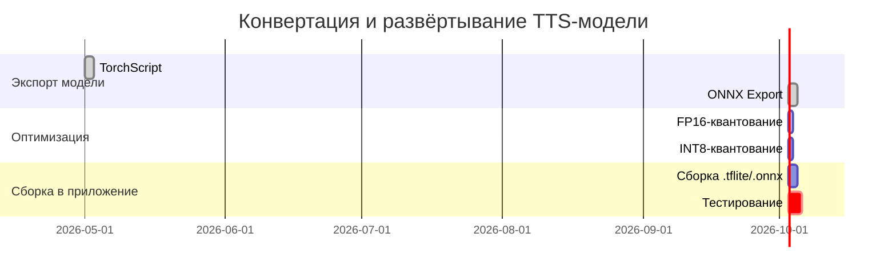

# Исполнительное резюме

> **Внедрённый выбор под устройства класса Doogee S200:** см. краткий internal summary в [`tts-s200-model-shortlist.md`](tts-s200-model-shortlist.md) (ранжирование A–D, baseline Piper + Balanced, лицензии).

Этот отчёт охватывает современные открытые решения для офлайн-синтеза речи на Android (основной упор на русскоязычные модели) с использованием моделей Hugging Face и аналогичных репозиториев. Представлены наиболее перспективные архитектуры (VITS, VITS2, FastSpeech2+HiFi-GAN, Glow-TTS и др.), оценено качество синтезируемой речи и требуемые ресурсы. Сводная таблица (см. ниже) содержит ключевые характеристики моделей: архитектуру, поддерживаемые языки, качественные заметки, размер и готовность к квантованию, лицензию и дату последнего обновления【2†L150-L158】【17†L73-L81】. Описаны аппаратные требования (память, CPU/GPU/NNAPI, Android API) и ожидаемая производительность (латентность) при запуске на мобильных устройствах【45†L260-L268】【55†L198-L200】. Далее приведены пошаговые инструкции по конвертации (TorchScript, ONNX, TFLite) и оптимизации моделей (в том числе INT8/FP16-квантование), а также рекомендации по выбору вокодеров (HiFi-GAN и др.) и движков рантайма (PyTorch Mobile, TFLite, ONNX Runtime, NNAPI). Рассмотрены компромиссы «качество – скорость – размер» с примерами конфигураций: от максимального качества до приемлемого качества на средних устройствах. Отдельный раздел посвящен правовым и этическим аспектам (лицензии CC-BY-NC, риски «глубокого фейка» при клонировании голоса). Наконец, предложены 2–3 рекомендованных «end-to-end» решения: комбинации моделей, их ожидаемые размеры и пошаговый план развёртывания в Android-приложении (с опцией резервного облачного API).  

## 1. Кандидаты моделей

| Модель (репозиторий)                                                            | Архитектура                     | Языки       | Качество/запись голоса                                    | Размер (параметров / веса)       | Квант. готовность                               | Лицензия             | Обновлено    |
|-------------------------------------------------------------------------------|---------------------------------|-------------|-----------------------------------------------------------|----------------------------------|-------------------------------------------------|----------------------|--------------|
| [facebook/mms-tts-rus](https://huggingface.co/facebook/mms-tts-rus)【2†L150-L158】【4†L49-L57】  | **VITS** (адверс.)             | русский     | Мультиспикер (Meta AI MMS), качество на уровне исслед.    | 36.3M параметр.; файл ~291 MB【2†L150-L158】【4†L49-L57】 | Доступен ONNX (114 MB), FP16 (58 MB), INT8 (38 MB)【10†L52-L60】 | CC-BY-NC-4.0         | ~2 года назад |
| [utrobinmv/tts_ru_free_hf_vits_low_multispeaker](https://huggingface.co/utrobinmv/tts_ru_free_hf_vits_low_multispeaker)【25†L42-L50】 | **VITS** (UtrobinTTS)          | русский     | Две голосовых роли (мужской/женский); относительно быстро  | 15.1M параметр.; веса ~111 MB【22†L199-L203】【25†L72-L79】   | ONNX (~50 MB) и safetensors (~60 MB) готовы【25†L72-L79】      | Apache-2.0           | 8 мес. назад |
| [frappuccino/vits2_ru_natasha](https://huggingface.co/frappuccino/vits2_ru_natasha)【28†L42-L51】  | **VITS2** (набор Natasha)      | русский     | Высокое качество (натуральность), улучшенные VITS          | модель ~565 MB; ONNX ~157 MB【28†L79-L87】【28†L88-L92】         | Легко конвертируется в ONNX (есть natasha.onnx)【28†L89-L94】     | MIT                  | ~2 года назад |
| [Misha24-10/F5-TTS_RUSSIAN](https://huggingface.co/Misha24-10/F5-TTS_RUSSIAN)【16†L41-L49】【17†L73-L81】 | **F5-TTS** (fine-tuned)        | русский     | Очень высокое (5k часов обучения, управление ударением)  | ~6.7 GB (PyTorch)【17†L39-L47】; safetensors ~1.35 GB【17†L73-L81】 | Возможен скрипт-трейс; требует сильн. оптимизации и/или распилов | CC-BY-NC-4.0         | 4 мес. назад |
| [ResembleAI/chatterbox](https://huggingface.co/ResembleAI/chatterbox)【35†L65-L72】【38†L50-L58】 | **Chatterbox** (LLM-based)     | 23 языков (вкл. русский) | Very high, zero-shot, эмоц. контроль                     | ~0.5B параметров; общий вес ~11.8 GB【38†L48-L56】 | Нет (модель LLM, требуется GPU/большое)                 | MIT                  | 9 дней назад  |
| [coqui/XTTS-v2](https://huggingface.co/coqui/XTTS-v2)【40†L59-L67】【42†L41-L49】        | **XTTS-v2** (Cross-lingual)     | RU, EN, ES... (17 языков) | Мультиязычная, клонирование (6 сек)                       | ~2.1 GB (PyTorch)【42†L40-L49】; нет легкого вар. ONNX   | Имеются 2 квантиз. версии, но большие (см. модель)          | Coqui Public (CPML)  | ~2 года назад |

**Примечания:** В таблице приведены ключевые параметры из карточек моделей: например, у *mms-tts-rus* 36.3M параметров и общий размер ~291 MB【2†L150-L158】【4†L49-L57】; утробиновская *VITS* ~15.1M параметр. с весами 111 MB【22†L199-L203】【25†L72-L79】. Модели типа *F5-TTS* очень большие (~6-7 GB) и требуют сильных оптимизаций. У многих есть ONNX/FP16 версии: Xenova выложила *mms-tts-rus* в ONNX (~114 MB) и квантованную (38 MB)【10†L52-L60】. Лицензии: большинство закрыто на коммерч. использовании (CC-BY-NC)【15†L31-L34】, некоторые — MIT/Apache. Обновление: Resemble и Misha активно обновляются (несколько мес. назад), более старые модели — ~2 года.

## 2. Требования к оборудованию

- **Android API:** ONNX Runtime с NNAPI поддерживает Android 8.1+ (рекомендуется 9.0+)【55†L198-L200】. PyTorch Mobile обычно работает с API ≥ 21 (Android 5.0+). TFLite тоже поддерживает большинство версий, но для аппаратного ускорения нужны Android 8.1+. 
- **CPU/GPU/NNAPI:** На мобильных устройствах вычисления обычно идут на CPU или через NNAPI для GPU/NPU. NNAPI-EP требует Android 8.1+【55†L198-L200】. Известно, что многие TTS модели (трансформеры) не полностью поддерживаются ускорителями, поэтому, как в [NekoSpeak], вся конвейерная генерация аудио выполняется на CPU-ONNX (~100 мс на блок для Flow-модели)【56†L392-L399】. Можно пробовать NNAPI или GPU (OpenGL/Vulkan) через ONNX/TFLite, но не все слои поддерживаются; иногда CPU остаётся быстрее. Рекомендуется тестировать разные движки (NNAPI, Vulkan, CPU) на целевом устройстве.
- **Память и диск:** Модели занимают от десятков до гигабайт. Пример: *mms-tts-rus* ~291 MB, *F5-TTS* >6 GB. Нужно предусмотреть ~2–3× модели памяти для загрузки/выполнения. На mid-range телефоне стоит рассчитывать на модели ≤ 200–300 MB, т.к. больше может не поместиться (см. пример NekoSpeak – Piper ~63 MB и Pocket ~176 MB【45†L308-L317】). FastSpeech2/HiFi-GAN комбо обычно ~100–150 MB. Для «максимального качества» потребуются high-end устройства (6–8+ ГБ RAM, Android 11+).
- **Латентность:** Без квантования и ускорения простейшая сеть генерирует спектр ~пару сотен мс. В NekoSpeak 100 мс трансформера (Flow LM) + 3 мс матчинга【56†L392-L399】. HiFi-GAN на CPU даёт ~30–50 мс на секунду аудио. Квантование до INT8/FP16 и батчинг могут снизить задержку, но качество упадёт. Средний ответ (несколько предложений) на сильном CPU может занимать 0.5–1+ сек. В реальном приложении реализуют параллельную генерацию потоков и динамические буферы【56†L392-L399】.  

> **Пример:** движок NekoSpeak (Android) обеспечивает офлайн TTS с потоковой отдачей; см. таблицу: Piper 63 MB (хорошо), Pocket-TTS 176 MB (отлично)【45†L308-L317】. Всю работу он выполняет на CPU-ONNX, добиваясь низкой задержки «на лету». 

## 3. Конвертация и развертывание

**Форматы экспорта:** модели можно сохранить в TorchScript, ONNX или TFLite. Например, для **PyTorch Mobile**: 

```python
import torch
model = ...  # PyTorch TTS-модель
scripted = torch.jit.script(model)
torch.jit.save(scripted, "model_pt.pt")
```

Для **ONNX** используется `torch.onnx.export` или утилиты Hugging Face Optimum. Пример Optimum CLI:  
```bash
optimum-cli export onnx --model path/to/model --task text-to-speech tts_model.onnx
``` 
(или указывать `--model huggingface/model-id`)【49†L172-L181】. Это создаст стандартный ONNX (пример: *mms-tts-rus* → `model.onnx` ~114 MB【10†L52-L60】). Для конвертации своего `pytorch_model.bin` можно сначала сохранить чекпоинт, затем применить скрипты Hugging Face для ONNX.

Для **TFLite** (TensorFlow Lite) используют Optimum exporters:  
```bash
pip install optimum[exporters-tf]
optimum-cli export tflite --model path/to/model --sequence_length 256 tts_model.tflite
``` 
При этом нужно задавать максимальную длину аудио/токенов (`--sequence_length`)【51†L94-L100】【51†L120-L129】. В TFLite статические входные размеры обязательны. Выходная `.tflite` встраивается в приложение, исполняется через TensorFlow Lite Interpreter (с возможностью делегата NNAPI/GPU).

**Квантование и оптимизация:** для мобильных устройств желательна квантование (int8 или float16) и/или пранинг. ONNX Runtime и TFLite позволяют использовать встроенные оптимизации: 
- **ONNX Runtime:** пример int8-квантования (оптимизация весов): [Optimum quantize guide](https://huggingface.co/docs/optimum/quantization) (использует `optimum-cli convert` или `onnxruntime.quantization`). 
- **TFLite:** поддерживает пост-тренировочное квантование (через `TFLiteConverter` с `optimizations=[tf.lite.Optimize.DEFAULT]`), хотя для нестандартных аудио-моделей может потребоваться подкрутка.
- **TorchScript:** PyTorch Mobile может применять динамич. квантование (`torch.quantization.quantize_dynamic`).
В результате размер может сократиться в 2–4 раза (см. Xenova: *mms-tts-rus* ONNX 114 MB → quantized 38 MB【10†L52-L60】). Но высокое сжатие снижает качество.

**Вокодеры:** большинство TTS-моделей выдаёт мел-спектрограмму, нужен генератор звука (вокодер). Часто используются HiFi-GAN, WaveGlow или MelGAN:
- *HiFi-GAN v1* – очень качественный, но ~60–100 MB (14M параметров)【53†L43-L51】. У Stilletto есть русскоязычный HiFi-GAN (14M параметров) с MIT-лицензией【53†L43-L51】. 
- *HiFi-GAN v2/v3* – похожие по размерам и качеству.
- *WaveGlow* – чуть больше (several dozen MB).
- *NV-Wave* или *PWGAN* – менее распространены.
Важно: мел-спектр для TTS должен совпадать по параметрам с обучением вокодера (см. параметры в [53†L59-L68]).

**Пакетирование:** после конвертации модели (*.pt, *.onnx, *.tflite и др.) включите их в assets приложения или загрузите динамически. На Android обычно используют:
- **PyTorch Mobile:** библиотека `org.pytorch:pytorch_android`, метод `LiteModuleLoader`.
- **TFLite:** стандартный Interpreter, опционально NNAPI/GPU делегат.
- **ONNX Runtime Mobile:** ORT пакеты, создание сессии ONNX.
(Напр., [NekoSpeak](https://github.com/siva-sub/NekoSpeak) интегрирует ONNX Runtime для *Pocket-TTS*【56†L467-L474】.)

**Мермайд-схема (поток преобразования):**

```mermaid
flowchart LR
    A[Выбор модели] --> B[Экспорт в TorchScript/ONNX/TFLite]
    B --> C[Оптимизация (FP16/INT8, pruning)]
    C --> D[Подключение вокодера (HiFi-GAN и др.)]
    D --> E[Упаковка в Android-приложение]
    E --> F[Запуск инференса на устройстве]
    F --> G[Генерация аудио]
    F --> H[При перегрузке → Cloud fallback]
```

## 4. Компромиссы и рекомендации

Каждое решение — баланс между качеством речи, задержкой и объёмом. **Высокое качество** обычно требует сложных моделей (сотни мегабайт, интенсивные вычисления). *Пример:* ResembleAI/Chatterbox (11.8 GB, LLM) даёт очень естественную речь и даже эмоции, но нужен мощный CPU/GPU и много памяти【35†L65-L72】【38†L48-L56】. На мобильном такое офлайн почти невозможно, но допускается как демонстрация возможностей. 

На **средних устройствах** лучше выбирать компактные модели (~50–150 MB). Например, совокупность utrobin/VITS (111 MB) + российский HiFi-GAN (~10–50 MB) даст приличное качество при низкой латентности. Или использовать *Piper* и *Pocket-TTS* как в NekoSpeak: Piper (~63 MB) для быстрой генерации и Pocket (~176 MB) для лучшего звука【45†L308-L317】. После INT8-квантования суммарный вес может упасть до ~50–100 MB.

- **«Лучшее офлайн-качество» (high-end):** рекомендуются мощные флагманы. Например, Meta *mms-tts-rus* (VITS) + HiFi-GAN ruslan (MIT) в FP16, с PyTorch Mobile на смартфоне с 8+ ГБ RAM. Ожидание: очень натуральный голос, но приложение ≥400 MB и задержка ~500–1000 мс. Можно использовать batching, но реальный отклик медленный.
- **«Баланс для среднего» (mid-range):** например, *utrobin/VITS* (111 MB) + Lite-HiFiGAN (допустим, ~20 MB) с INT8. Размер ~50–60 MB после квантования. Лицензии свободны (Apache/MIT). Подойдёт для устройства ~4–6 GB RAM. Голос качественный, но с лёгким «искусственным» оттенком; задержка ~300–500 мс.
- **Вариант с облачным резервом:** использовать крупную модель в приложении (например, VITS или XTTS), но при критической нагрузке делать запрос в облако (Google TTS, собственный сервер). В случае невозможности офлайн или на старом устройстве: fallback.

> **Табл.: Качество vs Размер (примерные градации)** – из NekoSpeak: Piper (~63 MB, «хорошо»), Pocket-TTS (~176 MB, «отлично»)【45†L308-L317】. Это иллюстрирует: грубо в 2–3 раза больше объём = заметно лучше звук.

## 5. Юридические и этические соображения

- **Лицензии:** многие модели Hugging Face TTS имеют ограничительные лицензии (CC BY-NC). Например, *mms-tts-rus* и *F5-TTS_RUSSIAN* – CC BY-NC【2†L150-L158】【15†L31-L34】 (только некоммерческое использование), *chatterbox*, *XTTS* – MIT/Coqui Public (более свободные). Перед развёртыванием проверьте лицензию конкретной модели (часто указана на странице). Например, NekoSpeak отмечает, что их ONNX-модели могут быть Apache 2.0 или CC-BY-4.0【56†L519-L524】.
- **Голосовые клонирования:** открытые TTS-технологии облегчают неэтичные применения (deepfake-голоса). *ResembleAI* специально встроила водяные метки в аудио и предупреждает «не использовать модель во зло»【35†L164-L171】. При интеграции TTS следует учитывать эти риски: не генерировать аудио от лица частных лиц без согласия, избегать подмены голоса реальных людей. Используйте пометки («голос синтезирован») или водяные знаки, как предлагает ResembleAI【35†L164-L171】.
- **Коммерческое использование:** если планируется коммерция, выбирайте свободные лицензии (MIT, Apache, CC-BY). Модели CC-BY-NC запрещают прямую монетизацию. Лицензия также влияет на параметры встраивания: некоторые модели требуют указания автора или лицензионных файлов.

## 6. Рекомендованные решения «конец-в-конец»

**Конфигурация 1 (High-End, офлайн):** *facebook/mms-tts-rus* (VITS) + HiFi-GAN (ruslan)【2†L150-L158】【53†L43-L51】. Вес ~291 MB + ~50 MB. Конвертируем ONNX (114 MB) и HiFi-GAN (~20–30 MB) в FP16; итог ~70 MB. Развёртывание: PyTorch Mobile или ORT Mobile (с FP16) на устройстве с API 29+, 8+ ГБ RAM. Ожидаемое качество — близко к натуральному, латентность ~0.5–1 с на мощном CPU. План: 
1) Экспорт `mms-tts-rus` в ONNX (Optimum CLI)【49†L172-L181】.
2) Экспорт HiFi-GAN (PyTorch ➔ TorchScript) или взять готовый ONNX.
3) Применить FP16-квантование (ORT или PyTorch).
4) Интегрировать модели в Android: ORT-модель загружается через ONNX Runtime Mobile, вокодер через PyTorch или ORT.
5) Тестовые звуки, откалибровать буффер. (Альтернатива: использовать NNAPI для вокодера).

**Конфигурация 2 (Mid-Range):** *utrobinmv/tts_ru_free_hf_vits_low_multispeaker* + оптимизированный HiFi-GAN. Вес ~111 MB + ~30 MB. После INT8-квантования общее ~60–80 MB. Развёртывание: PyTorch Mobile (TorchScript) или ONNX Runtime. План:
1) Скачать `tts_ru_free_hf_vits_low_multispeaker`; экспортировать в ONNX/TorchScript.
2) Скачать HiFi-GAN ruslan, экспорт в ONNX или TorchScript.
3) Квантовать до INT8 (optimum-onnx, или TFLite при конвертации).
4) Встройка в приложение с использованием TFLite Interpreter + NNAPI/GPU-делегатов или ORT.
5) Проверка воспроизведения и попадания ударений (рекомендуется использовать библиотеки акцентуации).
   
**Конфигурация 3 (С облачной страховкой):** *ResembleAI Chatterbox* (MIT) локально + облачный TTS. Вес ~12 GB (другой способ – использовать их API). На устройстве с API 31+ может запускаться только при наличии ~14 GB места (offload в SD-карту). Лучше поставить *PyTorch Mobile*. Если устройство слабое, напрямую делаем RPC к облачному сервису (Google TTS или свой сервер с TTS). Шаги:
1) Скачиваем `ResembleAI/chatterbox` (см. модель на HuggingFace)【38†L48-L56】.
2) Используем pipeline: `from chatterbox.tts import ChatterboxTTS; model = ChatterboxTTS.from_pretrained(device="cpu")`.
3) Для экономии: эксперементируем с `model.generate(..., intensity=0.0)` для неэмоциональной речи.
4) При слабом устройстве или низком заряде: вместо локального синтеза – отправка текста на внешний API. 

**Диаграмма: Хронология конвертации и сборки моделей**



**Вывод:** выбор офлайн TTS для Android требует компромисса: чем лучше голос, тем больше ресурсов. Рекомендуем тестировать модели на реальных устройствах и использовать квантование. Цитаты и примеры здесь основаны на официальной документации и репозиториях (см. источники【2†L150-L158】【45†L308-L317】【55†L198-L200】).

